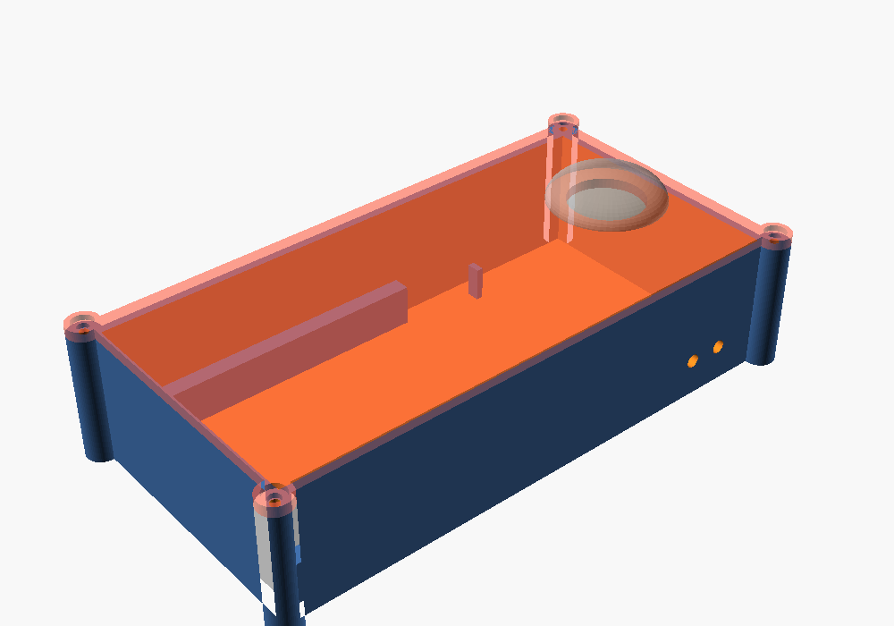

# Battery + Push-Button Housing

A two-part 3D-printable box (base + screw-on lid) that holds:

- 1 × **QTEATAK 8 × AA battery holder** (with cover and ON/OFF switch)
- 1 × **SMLBJUTE 22 mm red mushroom-head momentary push button** (1NO, SPST)

Two output wires leave the box through the side wall. An internal zip-tie anchor gives them strain relief.



## Files

| File | What |
|---|---|
| `button_box.scad` | Parametric OpenSCAD source. Edit the dimensions at the top. |
| `base.stl` | Ready-to-slice base, built from the default dimensions. |
| `lid.stl` | Ready-to-slice lid, already flipped top-face-down for printing. |

## ⚠️ Measure first

The battery holder's dimensions are **estimates** (113 × 64 × 29 mm, including the cover). Measure your parts with calipers. If they don't match, change these values at the top of `button_box.scad` and re-export:

- `holder_l`, `holder_w`, `holder_h`: battery holder size, including its cover
- `btn_body_d`: widest part of the button below the panel (nut across the corners)
- `btn_depth`: how far the button sticks down below the panel, including the terminals and wire bends
- `wire_d`: exit hole size (4 mm suits 18–22 AWG hook-up wire)

To re-export: `openscad -D 'part="base"' -o base.stl button_box.scad` (repeat with `lid`), or open the file in OpenSCAD, set `part`, press F6, then F7.

With the defaults the outer size is about **171 × 91 × 41 mm**, which fits the K1 SE's 220 × 220 mm bed. Print the base and the lid as two separate jobs, or put both on one plate.

## Print settings (Creality K1 SE / Creality Print)

- Material: PETG (tougher) or PLA
- Layer height: 0.2 mm
- Walls: 4 or more, top/bottom layers: 5
- Infill: 20 % gyroid
- **Supports: none needed.** The wire holes are small and bridge cleanly.
- Base: open side up. Lid: as exported (smooth top face on the bed).

## Hardware

- 4 × M3 × 10–12 mm screws. These thread straight into the 2.6 mm pilot holes in the corner posts.
  - If you'd rather use M3 heat-set inserts, set `screw_pilot = 4.0` (check the size your inserts need).
- 1 × small zip tie (3–5 mm wide)
- Optional: 4 stick-on rubber feet

## Wiring

```
Battery holder RED (+12 V) ──► Button terminal 1
Button terminal 2 ──────────► Output wire 1  (+, switched)
Battery holder BLACK (−) ───► Output wire 2  (−)
```

1. Put the battery holder in the main cavity with its **lead-wire/switch end facing the button compartment**. The side gaps near that end leave room for the leads.
2. Push the button through the lid hole from the top. Tighten the nut from underneath.
3. Wire it as shown above. Solder or crimp, and cover the joints with heat-shrink.
4. Feed the two output wires out through the side holes. Zip-tie them to the anchor bridge just inside the holes. (The tie goes through the tunnel under the bridge and over the wires.)
5. Leave the holder's own ON/OFF switch **ON**. The button is momentary, so nothing draws power until it's pressed. You can still switch the holder off inside the box for storage.
6. Screw the lid on. The ribs under the lid press the holder down so it doesn't rattle.

To change the batteries, remove the 4 lid screws, lift out the holder, and slide off its cover.

## Notes

- The button is rated 3–5 A. Eight AA cells give a nominal 12 V.
- If the lid ribs press too hard on the holder (or not hard enough), increase or decrease `holder_h` by about 0.5 mm.
